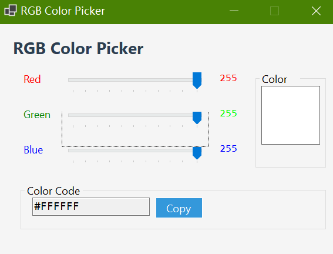

# RGB Color Picker (VB.NET WinForms)



## Description
A lightweight and intuitive color picker application built with VB.NET WinForms. It allows users to adjust RGB values via interactive sliders for real-time color previews, with instant conversion to hex codes. The generated hex code can be copied to the clipboard with one click, making it a handy tool for designers and developers needing quick color code access without relying on complex software.

Developed as a side project in October 2025 (within only one hour by the time), this tool prioritizes simplicity and practicality for daily color selection tasks.

## Personal Motivation
With the Postgraduate Entrance Exam approaching in less than a month, my schedule has been dominated by intensive review of Chinese Materia Medica, with hundreds of key points requiring memorization. Amidst this busy period, coding remains a consistent creative outlet that helps me stay balanced.

This project is now uploaded casually when I happen to stay up late, squeezing in time between my study sessions. It's a small reminder of my ongoing passion for programming even when time is limited. Sharing it here feels like a way to stay connected to technical learning, but obviously time waits for no one. I really have to stay focused on exam preparation afterwards.

## Prerequisites
- .NET SDK 8.0 or later

## Installation & Usage
1. Clone this repository to your local machine:
   ```bash
   git clone https://github.com/Pac-Dessert1436/Color-Picker-VB.git
   ```
2. Navigate to the project directory:
   ```bash
   cd Color-Picker-VB
   ```
3. Build and run the application:
   ```bash
   dotnet run
   ```
4. How to use:
   - Adjust the Red, Green, and Blue sliders (0-255 range) to mix your desired color
   - View the real-time color preview in the "Color Preview" panel
   - Check the RGB values (displayed next to each slider) and corresponding hex code
   - Click "Copy Code" or press Enter while focused on the hex code field to copy the code to your clipboard
   - A temporary "Copied to clipboard!" notification will confirm successful copying

## Features
- Interactive RGB sliders with precise value control (0-255)
- Real-time color preview and RGB value display
- Automatic conversion from RGB to standard hex color format (#RRGGBB)
- One-click hex code copying to clipboard (with visual confirmation)
- Clean, modern UI with intuitive layout
- Fixed window size for consistent user experience
- High DPI support for sharp rendering on all displays

## License
This project is licensed under the MIT License. See the [LICENSE](LICENSE) file for full details.